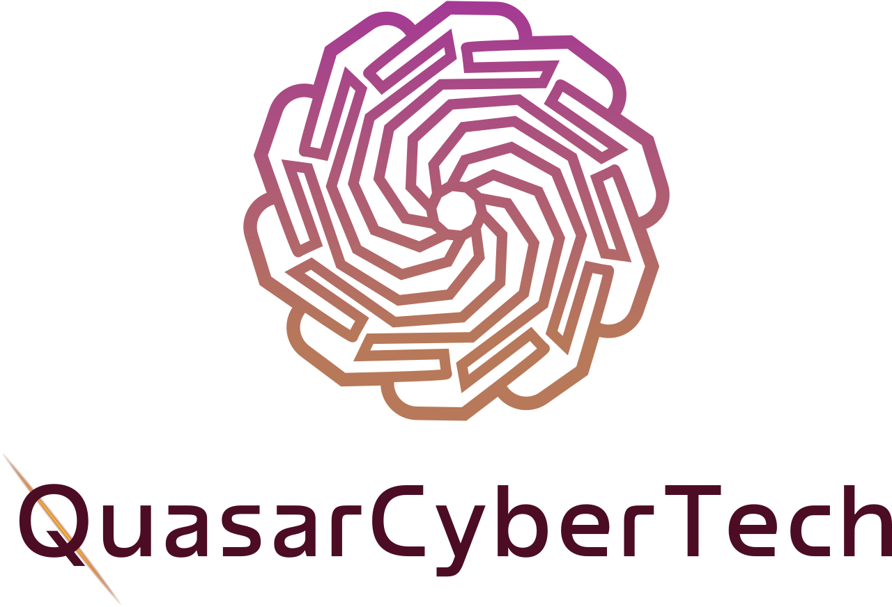

# QuasarCyberTech Platform



## Resilience Engineered, Security Delivered

Welcome to the official repository for the QuasarCyberTech enterprise platform. This high-performance, security-first web application represents our core digital presence and service delivery interface. Built with an uncompromising focus on performance, scalability, and design excellence.

---

## Architecture & Core Philosophy

The QuasarCyberTech codebase is architected as a **Data-Driven SPA** (Single Page Application). Our philosophy is to separate concerns by decoupling business logic and content from visual implementation.

### Centralized Design System (`src/config/themeConfig.ts`)
The entire visual identity of the platform is managed through a single source of truth.
- **Design Tokens**: Centralized HSL colors, strict spacing scales, and Typography presets.
- **Advanced Control**: Global layout variables (padding, gaps, border-radius) allow the entire UI to be re-tuned in seconds.

### Asset Orchestration (`src/constants/assets.ts`)
We treat assets as primary citizens.
- **Unified Manifest**: Every image, logo, and infographic is registered in a central `ASSETS` manifest.
- **CDN Ready**: Integrated Cloudinary support allows switching from local assets to a global CDN via a single boolean toggle.
- **Optimization**: Automated image optimization (format & quality) is baked into our asset delivery pipeline.

### Platform Ecosystem
The site isn't just a marketing tool; it's a gateway to our engineering products:
- **QRGT**: Risk & Governance Tool
- **QStellar**: Threat Intelligence Hub
- **QPulse**: Security Operations Center Hub
- **QLeap**: The Cybersecurity Training Pathway

---

## Technology Stack

| Layer | Technology |
| :--- | :--- |
| **Framework** | [React 18+](https://react.dev/) |
| **Build Tool** | [Vite](https://vitejs.dev/) |
| **Language** | [TypeScript](https://www.typescriptlang.org/) |
| **Animations** | [Framer Motion](https://www.framer.com/motion/) |
| **Styling** | [Tailwind CSS](https://tailwindcss.com/) & Vanilla CSS |
| **Components** | [Radix UI](https://www.radix-ui.com/) |
| **Maps** | [React Simple Maps](https://www.react-simple-maps.io/) |

---

## Lead Generation & Automation

Our contact infrastructure is entirely serverless and performance-optimized:
- **Backend**: Google Apps Script (GAS) acting as a lightweight REST API.
- **Database**: Centralized Google Sheets for real-time CRM integration.
- **Notifications**: Instant SMTP triggers ensure zero-latency lead reporting.

---

## Getting Started

### Prerequisites
- Node.js (v18.0.0 or higher)
- npm or yarn

### Installation
```bash
# Clone the repository
git clone https://github.com/QuasarCyberTech/quasarcybertech-website.git

# Install dependencies
npm install

# Start the development server
npm run dev
```

### Building for Production
```bash
# Generate the production bundle
npm run build

# Preview the production build locally
npm run preview
```

---

## 📝 Contribution & Maintenance

- **Adding Services**: Update `src/data/capabilitiesData.ts` to add new service offerings.
- **Adding Assets**: Register new imagery in `src/constants/assets.ts` to ensure consistent delivery via local or CDN paths.
- **Theme Updates**: Modify `src/config/themeConfig.ts` to update the global design language.

---

© 2026 **QuasarCyberTech**. All rights reserved.
